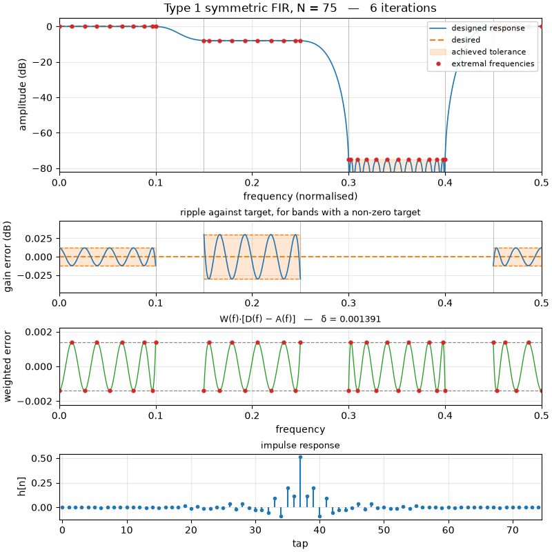

# Digital filter designer

A from-scratch implementation of the two classical ways to design a digital
filter, with a Tk GUI: constraints and filter parameters on the left, the
specification and the resulting filter plotted on the right. The **Mode**
pulldown at the top left chooses between them, and the **View** pulldown above
the plots switches between the response curves and a diagram of the structure
you would build.

- **FIR — Remez exchange.** The Parks–McClellan algorithm for optimal
  (equiripple) linear-phase FIR filters, over arbitrarily many bands.
- **IIR — bilinear transform.** Butterworth, Chebyshev I, Chebyshev II and
  elliptic lowpass, highpass, bandpass and bandstop filters, designed from an
  analog prototype and mapped to the unit disc.

The plot panel, here on the multiband FIR preset:



## Running it

```bash
python3 -m venv --system-site-packages .venv && .venv/bin/pip install -r requirements.txt
```

```bash
.venv/bin/python remez_gui.py
```

Requires numpy and matplotlib; the algorithms themselves (`fir_core.py` and
`iir_core.py`) need only numpy. scipy is used by the tests to cross-check
designs, not by the program.

## FIR mode

**Filter** sets the length, the symmetry, and the sample rate. Band edges are
entered in whatever units the sample rate is in — leave it at 1.0 for normalised
frequency (0 … 0.5 cycles/sample), or set it to 48000 to type edges in Hz. The
preset menu fills the table with a lowpass, highpass, bandpass, bandstop,
multiband, Hilbert transformer, differentiator, or a sloped band.

**Bands and constraints** is one row per approximation band:

| column | meaning |
| --- | --- |
| F start, F stop | band edges; bands must not overlap, and the gaps between them are the transition regions, left unconstrained |
| Desired at start / at stop | target amplitude, ramping linearly across the band — set them equal for a flat band, or unequal for a differentiator or a sloped response |
| Weight | relative importance; the algorithm equalises `weight × error`, so a band with ten times the weight ends up with a tenth of the ripple |
| Spec (dB) | used instead of Weight when the checkbox below is ticked |
| 1/f | weight the band by 1/f, which equalises *relative* error — the usual choice for a differentiator |

Tick **Derive weights from the spec column** to work in decibels instead of bare
weights: give each passband its peak-to-peak ripple in dB and each stopband its
attenuation in dB, and the weights that ask for that ratio of ripples are
computed for you. The report then says whether each spec was actually met, and
if not, roughly how many taps it would take (Kaiser's estimate).

Press **Design**, Return or F5 after editing. Coefficients export as CSV or as a
C header, the plot exports as PNG, PDF or SVG, and **Save C…** writes a working
implementation — see [Save C](#save-c) below.

The four panels show:

1. the amplitude response against the desired response and the achieved
   tolerance envelope, with the extremal frequencies marked;
2. the ripple of each non-zero-target band relative to its target, where a
   fraction of a dB is actually visible;
3. the weighted error `W(f)·[D(f) − A(f)]`, which is flat-topped at `±δ` between
   the alternating extrema — this is the algorithm's own view of the problem;
4. the impulse response.

## IIR mode

**Filter** picks the response (lowpass, highpass, bandpass, bandstop) and the
approximation (Butterworth, Chebyshev I, Chebyshev II, elliptic), and either
takes an order or works out the smallest one that meets the specification.

**Bands and specification** is the specification itself: the passband edge, the
stopband edge, the peak-to-peak passband ripple in dB and the stopband
attenuation in dB. A bandpass or bandstop takes two of each, ordered
`fs1 < fp1 < fp2 < fs2` and `fp1 < fs1 < fs2 < fp2` respectively.

The filter is placed so that the edge each approximation actually pins down
falls exactly on the frequency asked for — the passband edge, except for
Chebyshev II, which is defined by where its stopband begins. The other edge is
what the order is worked out from. A Butterworth has no ripple to pin an edge
to, so it is widened from its −3 dB normalisation until the response is exactly
`rp` dB down at the passband edge; this is the same convention `scipy.signal`'s
`buttord` uses, and it means the passband spec is met exactly whatever order
you choose.

| approximation | passband | stopband | order for 0.5 dB / 60 dB over 0.2 … 0.25 |
| --- | --- | --- | --- |
| Butterworth | maximally flat | maximally flat | 25 |
| Chebyshev I | equiripple | monotonic | 11 |
| Chebyshev II | monotonic | equiripple | 11 |
| Elliptic | equiripple | equiripple | 7 |

The five panels show the magnitude against the specification mask, the passband
ripple zoomed onto the passband, the group delay with the unwrapped phase
behind it, the pole-zero pattern (with `×n` marking coincident roots), and the
impulse and step responses. Coefficients export as second-order sections, in
CSV or as a C array ready to cascade.

Note that the bilinear transform is geometrically symmetric about the band
centre while your edges generally are not, so for a bandpass or bandstop one of
the two transitions comes out wider than requested. The report says whether
each spec was actually met.

## Arithmetic: floating or fixed point

Both designs are carried out in double precision, but hardware rarely runs them
that way. The **Arithmetic** panel chooses what the coefficients are finally
stored as, and everything downstream — the plots, the report, both exports and
the generated C — then describes the filter you would actually build rather
than the one that was designed.

- **Floating point (double)** uses the coefficients exactly as designed.
- **Fixed point** rounds every coefficient to a signed two's-complement integer
  of the chosen word length with an implied binary point, so the value used is
  `integer × 2⁻ᶠ`, the format usually written Q(B−1−F).F.

The binary point is placed automatically, as far left as the largest
coefficient allows, since headroom that is not needed is resolution given away;
untick the box to set it yourself. The panel reports the format, the resolution,
the representable range and the largest rounding error, and says so loudly if
anything had to be clipped to fit.

Two more settings in the panel belong to the hardware rather than the
coefficients, and are described under [Generate SV](#generate-sv):
**headroom**, which widens the datapath above the coefficient format, and
**fixed coefficients**, which decides whether the RTL builds the values in or
takes them on a port.

Rounding is not free, and the point of showing it is that the cost is specific
and visible:

- **FIR.** The stopband floor rises and the equiripple property is gone — the
  weighted error, which the exchange had flat at ±δ, now runs outside it. The
  plot keeps the original design behind the quantized one, and the report gives
  the per-band cost. Linear phase does survive: symmetric taps are equal to the
  last bit, so they round identically.
- **IIR.** The poles move, and the pole-zero panel shows where they were. A
  short word on a sharp filter pushes one onto or outside the unit circle and
  the filter becomes unstable, which the report calls out. Rounding also shifts
  the passband gain, which peak-to-peak ripple does not reveal, so that is
  reported separately.

What is modelled is coefficient quantization only. The arithmetic in the
datapath — rounding of products, accumulator width, overflow behaviour — is a
separate question and is not simulated.

## Save C

**Save C…** asks where to put it and writes a self-contained C file that
implements the filter currently on screen — the biquad cascade in IIR mode, the
tapped delay line in FIR mode.  For hardware rather than software, see
[Generate SV](#generate-sv). The interface is the same either way:

```c
typedef struct { ... } t_ctx;

int    init_filter(t_ctx *ctx);                     /* 0, or -1 out of memory */
double process_sample(double sample, t_ctx *ctx);
void   free_filter(t_ctx *ctx);
```

`init_filter` allocates the filter's own state — two delay elements per biquad,
or one delay line of `N` samples — and zeroes it; `process_sample` takes one
sample and returns one filtered sample; `free_filter` gives the state back. The
coefficients are a `static const` table in the file, printed to seventeen
significant figures, so nothing rounds on the way out. In fixed point the
values printed are the rounded ones, and the CSV and header exports carry the
stored integers and the binary point alongside them.

The generated IIR code runs the same transposed direct form II in the same
section order as `iir_core.sos_filter`, and a test compiles it and checks it
agrees bit for bit. Compile it with `-DFILTER_MAIN` and you get a stand-alone
program that filters whitespace-separated doubles from stdin to stdout:

```bash
cc -std=c99 -O2 -DFILTER_MAIN -o myfilter myfilter.c && ./myfilter < in.txt > out.txt
```

## Generate SV

**Generate SV…** writes the structure the design view draws as synthesisable
SystemVerilog. It needs fixed-point coefficients — there is nothing to build a
multiplier from otherwise — and refuses, with a reason, if any coefficient
saturated when it was quantized.

One file comes out, holding four modules plus the filter. The names are taken
from the filename you choose, so two generated filters can live in one project:

| module | what it is |
| --- | --- |
| `<name>_mul` | one coefficient multiply: exact product, rounded to nearest, saturated back to the datapath width |
| `<name>_add` | one datapath-width add, saturating |
| `<name>_sat` | clamps a wide signed value into a narrow one, used by both |
| `<name>_delay` | one unit delay, advancing only when `din_strb` is seen |
| `<name>` | the filter, instantiating the above in the topology of the design |

```systemverilog
module <name> #(parameter int NTAPS, WCOEF, FRAC, HEADROOM, WDATA) (
    input  wire                     clk,
    input  wire                     resetn,     // synchronous, active low
    input  wire signed [WDATA-1:0]  din,
    input  wire                     din_strb,
    output logic signed [WDATA-1:0] dout,
    output logic                    dout_strb
);
```

A strobe on `din_strb` with a sample on `din` advances the delay line and
registers the result, which appears on `dout` with `dout_strb` high for one
cycle — one clock of latency. Samples may arrive as slowly as you like; the
delay elements only move when strobed.

**Numbers.** Coefficients are `WCOEF` bits with `FRAC` fractional bits, exactly
as the Arithmetic panel quantized them. The datapath carries the same `FRAC`
fractional bits and `HEADROOM` extra integer bits, so everything — `din`,
`dout` and every internal signal — is `WDATA = WCOEF + HEADROOM` bits, and
unity is `1 << FRAC`. The **headroom** setting is what keeps the adder chain off
its limits: a direct-form FIR sums N products, and with no integer bits above
the coefficient format that sum clips. Adds saturate rather than wrap, because a
filter that clips is bad and one that wraps is unrecognisable.

**Coefficients.** With **fixed coefficients** ticked the values are
elaboration-time parameters, so synthesis can specialise every multiplier —
often into a few shifts and adds — and there is no coefficient port. Untick it
and the top level gains a packed `coeff` input that can be changed while the
filter runs, at the cost of real multipliers. The header comment lists which
slice holds which coefficient. For an IIR the slots are `b0 b1 b2 a1 a2` per
section, given exactly as designed: `a0` is 1 and nothing multiplies by it, and
`a1`/`a2` are negated inside the multiplier so the recursion's subtractions
need no separate subtractor.

An IIR comes out as a cascade of biquads in transposed direct form II, the same
arrangement the design view draws and the generated C runs.

One caveat on the plots: they show the response of the quantized *coefficients*
in exact arithmetic. The RTL additionally rounds every product and saturates
every add, so its response is close to the plotted one but not identical.
`sv_export.simulate` is a bit-exact model of the generated datapath if you want
to see the difference for a given signal.

The RTL lints clean under `verilator --lint-only -Wall`, and the tests compile
it and run it against a bit-exact Python model of the same datapath, sample for
sample, in both coefficient modes and for both filter kinds. An impulse pushed
through the compiled hardware returns the quantized taps exactly.

## Design view

The **View** pulldown above the plots switches from the response curves to the
data flow of the filter that is currently designed — the adders, unit delays
and multipliers you would actually build, each multiplier labelled with the
constant that goes into it. It redraws whenever the design does, and saves as
PNG, PDF or SVG through the same **Save plot…** button.

In IIR mode this is the biquad cascade: a strip along the top showing the
running order, then every second-order section drawn as **transposed direct
form II** — which is the structure `iir_core.sos_filter` runs and the one the
exported coefficients are meant for:

```
y[n]  = b0·x[n] + s1[n−1]
s1[n] = b1·x[n] − a1·y[n] + s2[n−1]
s2[n] = b2·x[n] − a2·y[n]
```

Each section is titled with its pole radius and pole frequency, and the signal
between sections is named `x[n] → w1[n] → w2[n] → … → y[n]` so the chaining is
explicit. An odd-order filter has one first-order section, which arrives padded
with zeros; those branches are drawn in grey rather than dropped, so the picture
and the six exported numbers per section stay in step. The overall gain is
folded into the first section's numerator, so there is no separate gain block.

In FIR mode it is the direct form — one tapped delay line into one accumulator,
with every tap labelled. Past thirteen taps the middle of the delay line is
replaced by a break, and the caption names exactly which taps are missing from
the picture; it also notes how many multipliers the symmetry-folded form would
need instead.

## The FIR algorithm

`fir_core.py` implements the exchange directly rather than wrapping
`scipy.signal.remez`. All four linear-phase types are supported by writing the
zero-phase amplitude as `A(w) = Q(w)·P(cos w)` and folding `Q` into the desired
response and the weight, which reduces every case to the same type-I problem:

| type | taps | symmetry | Q(w) | typical use |
| --- | --- | --- | --- | --- |
| I | odd | symmetric | 1 | any |
| II | even | symmetric | cos(w/2) | zero at Nyquist, so no highpass |
| III | odd | antisymmetric | sin(w) | Hilbert transformer |
| IV | even | antisymmetric | sin(w/2) | differentiator |

Each iteration solves for the deviation `δ` on the current reference set,
interpolates `P` through the resulting values in barycentric form, and moves the
reference to the alternating extrema of the new error curve.

A few details matter for robustness, and each is exercised by a test:

- **Extrema are found on the signed error**, not on `|error|`. A small dip of the
  opposite sign at a band edge is a genuine alternation even when `|error|` is
  larger right next to it, and missing those makes the search come up short.
- **Reference scaling.** An evenly spread starting reference is fine for short
  filters but collapses above roughly 100 coefficients: the first deviation
  underflows to round-off and the exchange has no signal to follow. Instead the
  problem is solved at half the size first and its reference scaled up,
  recursively. Across 500 randomised realistic designs this converges on all of
  them, where `scipy.signal.remez` raises "failure to converge" on 91.
- **The interpolation uses the first barycentric form**, in the log domain. The
  familiar second form — the ratio of two sums — has a denominator of
  `1/prod(x - x_j)`, which cancels to nothing outside the hull of the nodes and
  then returns a finite, completely wrong number, which is exactly what a wide
  unconstrained transition band asks for. The first form stays accurate to
  about `1e-14` at degree 100, verified against extended precision.
- **Taps come from the Chebyshev coefficients of `P`**, recovered with a DFT.
  Fitting the sampled amplitude instead is ill-conditioned exactly when a wide
  unconstrained transition band lets the polynomial run away.

## The IIR algorithm

`iir_core.py` builds the analog prototype from its poles and zeros, applies the
usual `lp2lp` / `lp2hp` / `lp2bp` / `lp2bs` substitutions, and maps the result
onto the unit disc with the bilinear transform, pre-warping the band edges so
they land back where they were asked for. Everything is carried in zero-pole-gain
form and only turned into coefficients at the end, as second-order sections
paired nearest-pole-to-nearest-zero and ordered with the sharpest section last.

The elliptic case is the one with any depth to it. It is the minimax solution of
the same approximation problem the Remez exchange solves, but over rational
rather than polynomial functions, which is why it needs so many fewer poles than
the alternatives — and unlike the exchange it is closed form, because Cauer
already solved it. Given the two ripple figures, the discrimination factor
`k1 = eps_p/eps_s` and the degree equation `n K'(k)/K(k) = K'(k1)/K(k1)` fix the
selectivity `k`, and the poles and zeros then come straight out of the Jacobi
elliptic functions `cd` and `sn`. Those are evaluated by the descending Landen
transformation — reduce the modulus to nothing, where `sn` is just a sine, then
undo the reductions one at a time — following Orfanidis, *Lecture Notes on
Elliptic Filter Design*.

Two numerical details are worth knowing about, and each has a test:

- **The complete elliptic integral is parameterised by the complementary
  modulus.** The order estimate needs `K(k)` and `K'(k)` for the same `k`, and
  one of the two is always evaluated at a modulus that is 1 to double precision
  if it is passed in directly. Taking `k'` as the argument and running the
  arithmetic-geometric mean from there keeps both accurate.
- **The degree equation has two solvers.** The Landen route above is exact until
  `k1` gets small enough — a fraction of a dB of passband ripple against 100 dB
  of stopband — that `sqrt(1 - k1²)` is 1 and every digit of `1 - sqrt(k')` is
  round-off. Below `k1 = 1e-6` it switches to the theta series in the nome,
  where the degree equation is simply `q = q1^(1/n)`, and forms the nome with
  `log1p`/`expm1` so the cancellation never happens.

## Tests

```bash
.venv/bin/python -m pytest -q
```

`test_sv.py` checks the generated RTL: that it lints without a warning, that
what Verilator computes matches the Python model of the datapath bit for bit,
that runtime coefficients give the same answer as built-in ones, that an impulse
returns the taps, and that headroom is what stops the adder chain clipping.

`test_fixed_point.py` checks the quantization: that values land on the lattice,
that the automatic binary point gives away no resolution, that linear phase
survives rounding, that an FIR stopband floor rises as bits are removed, and
that a short word can cost an IIR its stability.

`test_remez.py` checks the exchange — agreement with `scipy.signal.remez` on a
fine grid, the alternation and equiripple properties, tap symmetry, the four
types, weighting, and input validation. `test_iir.py` checks the IIR designs
against `scipy.signal`: the four analog prototypes over a range of orders and
ripples, the frequency transformations and the bilinear map, the order estimates
against `buttord`/`cheb1ord`/`cheb2ord`/`ellipord`, and the finished filters
against `iirfilter` — plus that the automatic order is the smallest one that
meets the spec, and that the elliptic prototype really is equiripple in both
bands. `test_gui.py` drives the real Tk widgets in both modes and both views,
from the entry fields through to the rendered figure — including that the
structure diagram has the right number of delays and adders for the filter it
is drawing and carries the actual coefficients, and that the exported C
compiles without a warning under `-Wall -Wextra -pedantic` and filters a random
signal to the same numbers the designer does. The C tests skip themselves if
there is no compiler on the machine.
