# remez — a tutorial

remez designs digital filters and shows you what you got. You type a
specification on the left; it designs the filter as you type and plots the
result on the right. When you like it, you export the coefficients, C, RTL, or
the design itself.

Two families are on offer:

- **FIR**, by the Parks–McClellan (Remez) exchange. Linear phase, unconditionally
  stable, as many taps as it takes.
- **IIR**, by the bilinear transform of a classical analogue prototype. Far fewer
  coefficients for the same selectivity, at the cost of non-linear phase and the
  need to watch stability.

Every figure below is generated from the program itself by
`test/make_docs_test.dart`, so if the interface changes and this document is not
regenerated, the tests notice. It loads real fonts before rendering: `flutter
test` normally substitutes a font whose every glyph is a filled rectangle,
which is right for a layout golden and useless for a screenshot.

---

## Contents

1. [The five-minute version](#the-five-minute-version)
2. [Reading the plots](#reading-the-plots)
3. [The panels, one at a time](#the-panels-one-at-a-time)
4. [Filter types and what they are good for](#filter-types-and-what-they-are-good-for)
5. [The save file](#the-save-file)

---

## The five-minute version

1. Leave **Mode** on *FIR*.
2. In **Filter**, set **Sample rate** to whatever your system runs at. The band
   edges rescale with it, so you can work in Hz rather than fractions.
3. In **Bands and constraints**, set the passband and stopband edges.
4. Watch the top plot. If the stopband is not deep enough, raise **Taps**.
5. **File → Save coefficients…** for a CSV or a C header, or **Save C…** for a
   filter you can compile and run.

Everything else on this page is detail.

---

## Reading the plots

### Lowpass

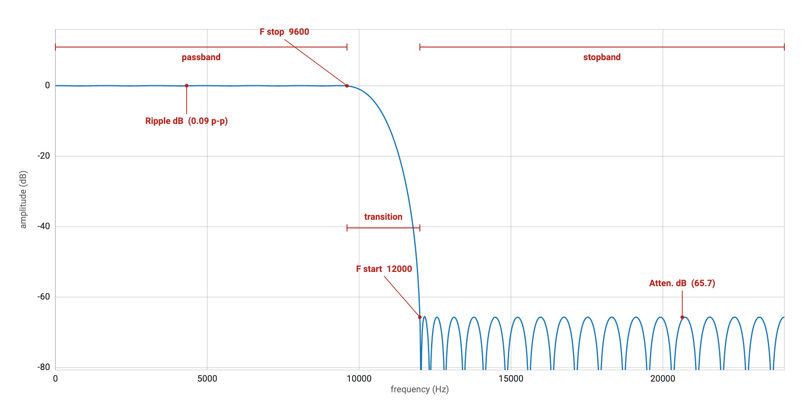

The band edges you type are the ends of the flat regions, *not* the −3 dB point
or the middle of the skirt. The **transition** between them is empty: nothing is
specified there and the design is free to do as it likes, which is why a
narrower transition costs taps.

- **F stop** of the passband row sets where the passband ends.
- **F start** of the stopband row sets where the stopband begins.
- **Ripple dB** is the peak-to-peak wobble allowed across the passband.
- **Atten. dB** is how far down the stopband is held.

The ripple is equal across the whole band and the stopband lobes are all the
same height. That is what "equiripple" means and it is the point of the Remez
exchange: for a given number of taps, no filter has a smaller worst-case error.
The red dots on the curve in the app are the extremal frequencies — the points
where the error touches its limit.

### Highpass

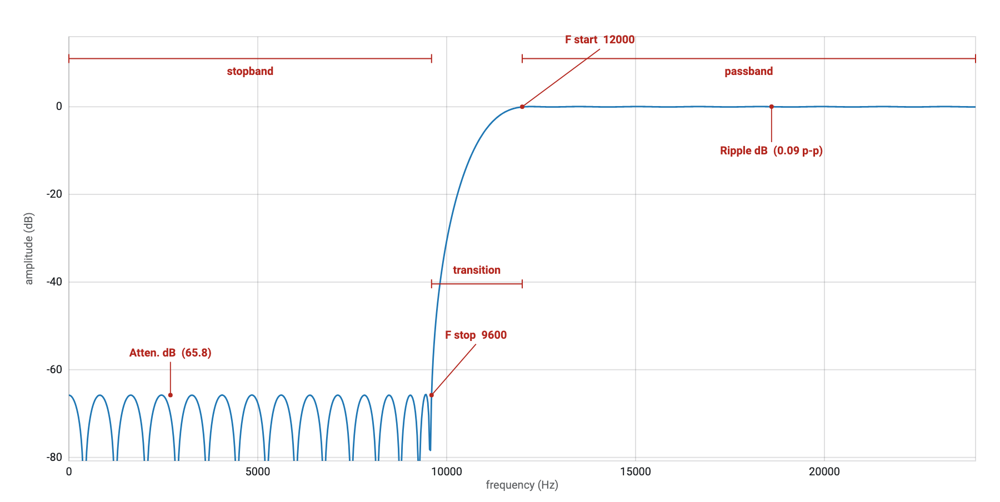

The same picture reflected. The stopband row now comes first and the passband
row second, so **F stop** of the stopband row and **F start** of the passband
row are the two edges that matter.

A highpass wants an *odd* number of taps if it must reach all the way to
Nyquist: an even-length symmetric filter (type II) is forced to zero there and
cannot be a highpass. remez will tell you in the **Result** panel if you have
asked for something the type cannot do.

### Bandpass

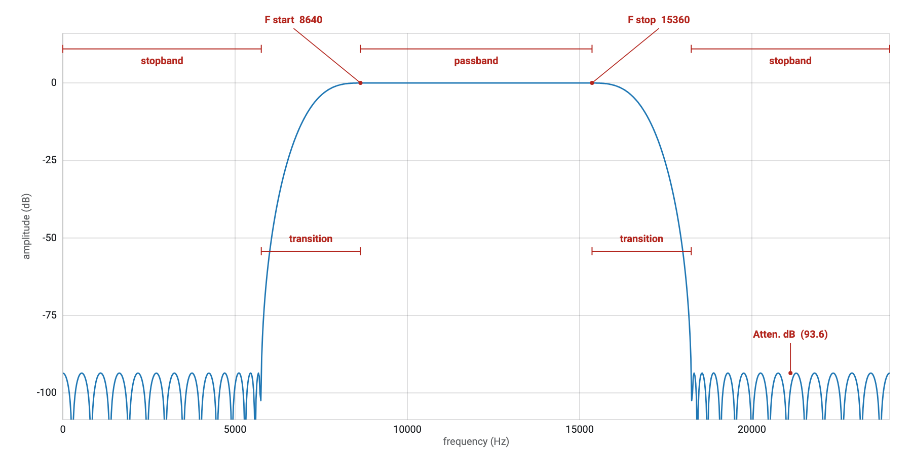

Three rows: stopband, passband, stopband. Two transitions, and they cost
separately — the narrower one sets the taps.

The two stopbands need not have the same attenuation. Give them different
**Weight** values (or different **Spec (dB)**) and the exchange will hold one
tighter than the other, spending its taps where you asked.

---

## The panels, one at a time

### Mode


FIR or IIR. The two have different **Filter** and band panels; everything else
is shared. Both designs are kept, so switching back and forth does not lose what
you typed.

### Filter — FIR

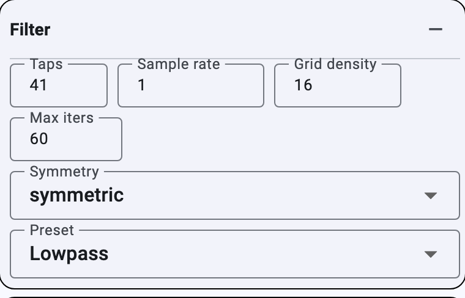

| field | what it does |
| --- | --- |
| **Taps** | The filter length N. More taps buy a narrower transition or a deeper stopband, at a cost of N multiplies and N−1 delays per sample. |
| **Sample rate** | The units everything else is in. Changing it *rescales* the band edges so the filter stays the same — set it first, then type edges in Hz. |
| **Grid density** | How finely the exchange samples each band when it searches for the error peaks, in points per coefficient. 16 is the usual value. Too coarse and the design steps over a ripple peak and reports a smaller δ than it achieved; see the note below. |
| **Max iters** | The iteration cap. 60 is far more than a converging design needs; if the **Result** panel says *did not converge*, the design ran out. |
| **Symmetry** | `symmetric` for ordinary filters; `antisymmetric` for a Hilbert transformer or a differentiator, which need a 90° phase shift. |
| **Preset** | Loads a worked example into the band table. A good starting point for a new design. |

**On grid density.** The reported δ is a *lower bound* on the true deviation,
never an upper one. Measured on the default lowpass against the response
evaluated at 200 001 points:

| grid density | reported δ | true peak error | optimism |
| --- | --- | --- | --- |
| 4 | 0.02848 | 0.03029 | +6.3 % |
| 16 (default) | 0.02877 | 0.02901 | +0.8 % |
| 64 | 0.02884 | 0.02886 | +0.04 % |

Leave it at 16 while exploring; raise it to 64 before you trust the number or
ship the coefficients.

### Bands and constraints — FIR

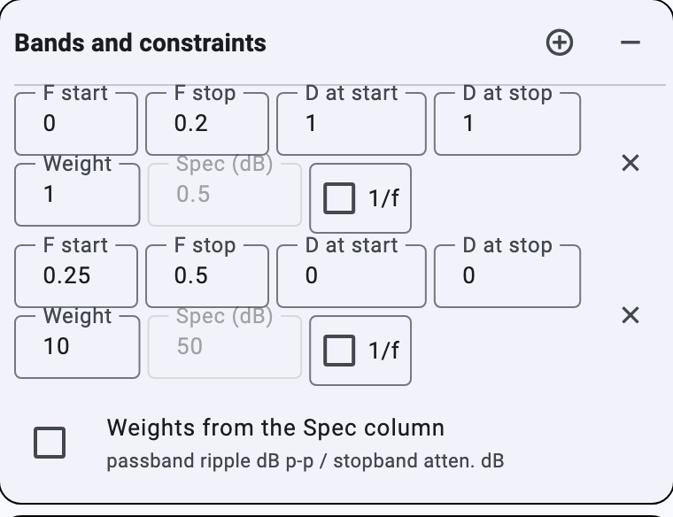

One row per band. Bands are given in order and must not overlap; the gaps
between them are the transition regions.

| column | what it does |
| --- | --- |
| **F start**, **F stop** | The band edges, in the sample-rate units. |
| **D at start**, **D at stop** | The desired amplitude at each end. Equal for a flat band; different for a sloped one — a raised-cosine skirt, or a differentiator's 2πf. |
| **Weight** | How hard this band is held relative to the others. The exchange equalises `W × \|D − A\|`, so doubling a weight halves that band's error and spends the taps elsewhere. Only the ratios matter. |
| **Spec (dB)** | An alternative to Weight, in decibels: peak-to-peak ripple for a band with a non-zero target, attenuation for one that targets zero. |
| **1/f** | Weight the band as `w/f` rather than a constant, which equalises *relative* error. What a differentiator needs — a fixed absolute error is negligible at the top of the band and hopeless at the bottom. |
| **✕** | Remove the row. |

The **⊕** button in the panel header adds a band.

**Weights from the Spec column.** Tick it and the Weight column greys out; the
weights are derived from the dB figures instead. This is usually what you want,
because "0.5 dB ripple and 60 dB attenuation" is a specification and
"weights 1 and 10" is a guess at one. The **Result** panel then checks each band
against its spec and, if one is missed, estimates the taps that would meet it.

### Filter — IIR

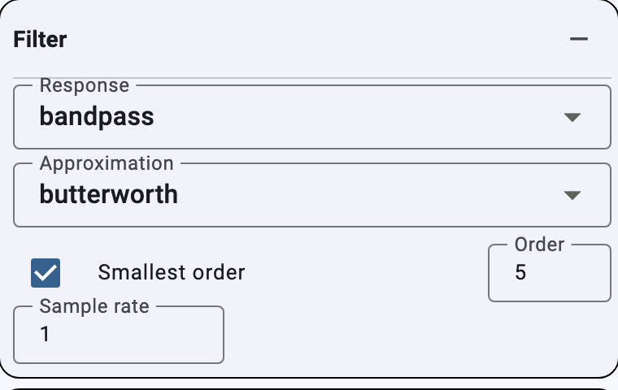

| field | what it does |
| --- | --- |
| **Response** | Lowpass, Highpass, Bandpass or Bandstop. Changing it brings edge values that make sense for the new shape. |
| **Approximation** | Butterworth, Chebyshev I, Chebyshev II or Elliptic. See [below](#the-four-iir-approximations). |
| **Order** | The prototype order. The digital filter has twice this many poles for a bandpass or bandstop. |
| **Smallest order** | Let remez pick the lowest order that meets the specification. Usually leave this on; turn it off to explore what a particular order does. |

### Bands and specification — IIR

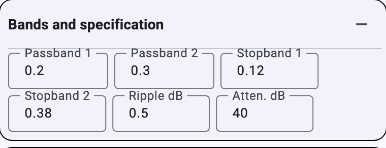

An IIR is specified by edges and tolerances rather than a table of bands.

| field | what it does |
| --- | --- |
| **Passband** (1, 2) | Where the passband ends. Two fields for a bandpass or bandstop. |
| **Stopband** (1, 2) | Where the stopband begins. |
| **Ripple dB** | Peak-to-peak passband ripple. Butterworth has no ripple by construction, but the figure is still used: the prototype is widened so the response is exactly this far down at the passband edge, rather than at the conventional −3 dB point. That puts all four approximations on the same footing. |
| **Atten. dB** | Required stopband attenuation. |

The design places the edge that its approximation actually pins down: the
passband edge for Butterworth, Chebyshev I and elliptic, the stopband edge for
Chebyshev II. The other edge falls where the order puts it.

### Arithmetic

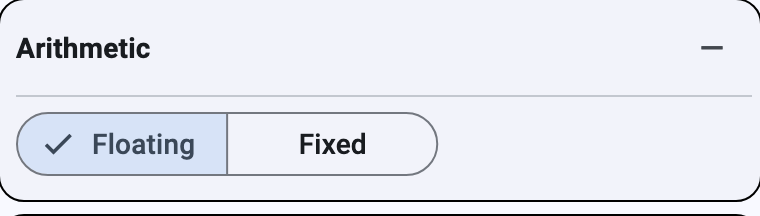

In **Floating** the coefficients are doubles and the plots show the ideal
design. Switch to **Fixed** and remez quantizes them and re-analyses, so the
plots and the report show the filter you would actually build.

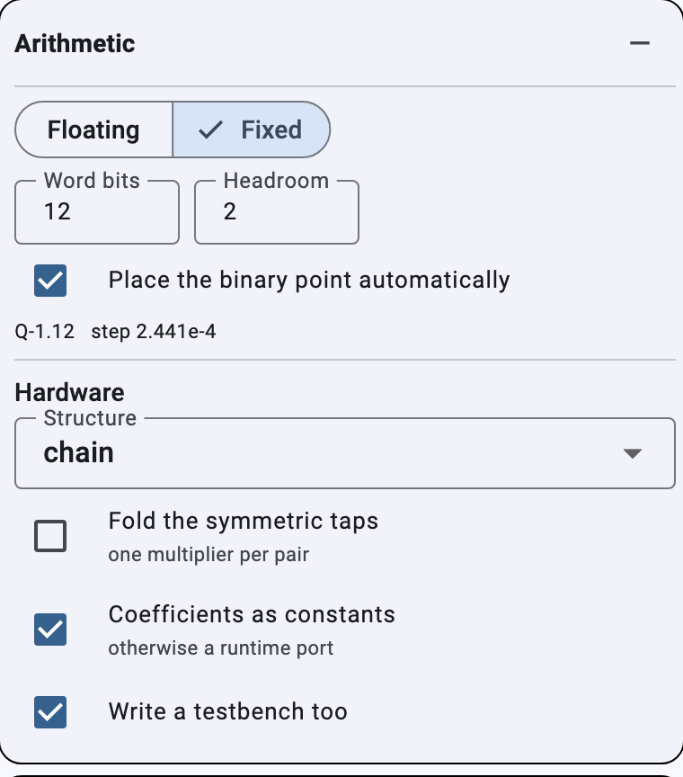

| field | what it does |
| --- | --- |
| **Word bits** | Coefficient word length. |
| **Headroom** | Extra integer bits in the datapath, above the coefficient format. This is what keeps the adders off their limits; 2 is a sensible default. |
| **Place the binary point automatically** | Puts the binary point where the largest coefficient just fits. Turn it off to set the fraction length yourself. |
| **Structure** | How the multiplies are summed in hardware: `chain` (one adder per tap — smallest, slowest), `tree` (balanced, registered between levels — fastest), `mac` (one multiplier reused, one term per clock — smallest of all, one sample per N clocks). |
| **Fold the symmetric taps** | A linear-phase filter has equal taps in pairs, so one pre-add plus one multiply serves two of them. Roughly halves the multipliers. |
| **Coefficients as constants** | Compile them into the RTL so synthesis can specialise each multiplier. Turn it off for a runtime coefficient port. |
| **Write a testbench too** | Emit a self-checking testbench beside the RTL. It carries the expected output of every sample, so running it proves the hardware matches the plots. |

The line under the fields reports the Q format, the step size, and a warning if
any coefficient saturated. A saturated coefficient means the hardware is not the
filter you designed — give it more bits.

### File

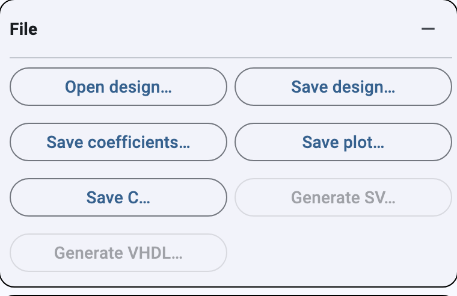

| button | what it writes |
| --- | --- |
| **Open design…** | Reads a `.remz` (or an older `.json`) design. |
| **Save design…** | Writes the whole specification as `.remz`. See [The save file](#the-save-file). |
| **Save coefficients…** | The coefficients alone. A `.h` extension gets C arrays; anything else gets CSV with a commented header. In fixed point both carry the stored integers alongside the rounded values. |
| **Save plot…** | The right-hand pane as a PNG — whichever view is showing, in whichever theme, at twice screen resolution. |
| **Save C…** | One self-contained C file: a library (`init_filter` / `process_sample` / `free_filter`) and a program that filters raw 64-bit floats from stdin to stdout. |
| **Generate SV…**, **Generate VHDL…** | Synthesisable RTL for the structure chosen in **Arithmetic**, with its testbench. Both need fixed-point coefficients; until then they are disabled and the tooltip says why. |

### Display

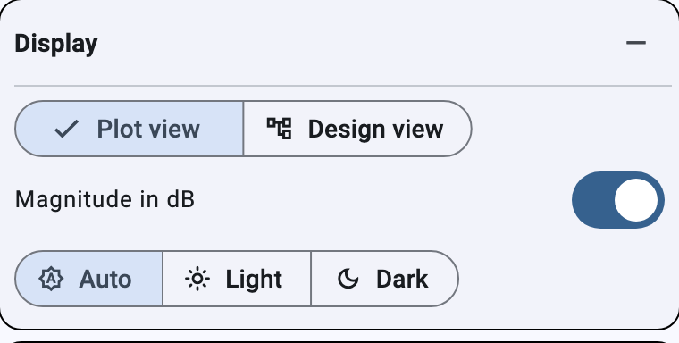

**Plot view** is the four response plots. **Design view** draws the filter as the
thing you would build — the adders, delays and multipliers, each labelled with
its actual constant. **Magnitude in dB** switches the top plot between decibels
and linear amplitude. **Auto / Light / Dark** follows the desktop or forces a
theme; the saved plot uses whichever is showing.

### Result

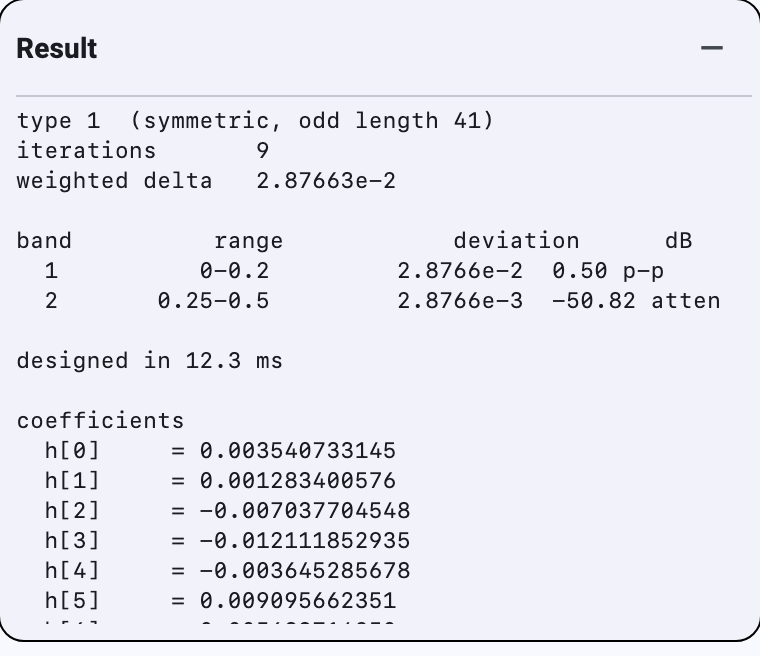

The report. Filter type and length, iterations, the weighted δ, then a table of
each band's achieved deviation in both linear and dB terms. In fixed point it
adds the Q format, the worst rounding error and the datapath width; with
**Weights from the Spec column** on it adds a spec check per band. It ends with
the coefficients themselves, which you can select and copy.

---

## Filter types and what they are good for

### The four linear-phase FIR types

Symmetry and length together decide what a filter can do. remez picks the type
for you and names it in the report; the constraints are not arbitrary but come
from what the amplitude response is forced to be at 0 and at Nyquist.

| type | symmetry | length | zero at DC? | zero at Nyquist? | use for |
| --- | --- | --- | --- | --- | --- |
| I | symmetric | odd | no | no | anything — lowpass, highpass, bandpass, bandstop, multiband |
| II | symmetric | even | no | **forced** | lowpass and bandpass only; never a highpass |
| III | antisymmetric | odd | **forced** | **forced** | Hilbert transformers, differentiators |
| IV | antisymmetric | even | **forced** | no | differentiators, highpass-ish antisymmetric work |

Practically: leave symmetry on `symmetric` and use an odd number of taps unless
you have a reason not to. Choose `antisymmetric` when you want a 90° phase
shift — the Hilbert transformer and differentiator presets set it for you.

### FIR against IIR

| | FIR | IIR |
| --- | --- | --- |
| phase | exactly linear | not linear; group delay varies, worst near the band edges |
| stability | unconditional | must be checked; remez reports max \|pole\| |
| coefficients for a sharp filter | many (tens to hundreds) | few (a handful of biquads) |
| quantization | graceful; the response degrades smoothly | poles can move onto or outside the unit circle |
| transient | finite, N samples | infinite |

Reach for FIR when phase matters, when the filter must be provably stable, or
when it will run on hardware with multipliers to spare. Reach for IIR when you
need a sharp filter cheaply and phase is not critical — audio equalisation,
control loops, decimation front-ends.

### The four IIR approximations

All four are shown here as lowpass filters of the same order, so the trade is
visible: everything gives up something to get selectivity.

| | passband | stopband | selectivity at a given order | phase |
| --- | --- | --- | --- | --- |
| **Butterworth** | maximally flat, no ripple | rolls off monotonically | worst | best behaved |
| **Chebyshev I** | equiripple | monotonic | better | worse |
| **Chebyshev II** | monotonic | equiripple | better | worse |
| **Elliptic** | equiripple | equiripple | best | worst |

- **Butterworth** — when the passband must be flat and you can afford the order.
  No ripple anywhere; the roll-off is gentle.
- **Chebyshev I** — accept some passband ripple, get a steeper skirt. The ripple
  is equal across the whole passband.
- **Chebyshev II** — the mirror: a clean passband and an equiripple stopband
  with transmission zeros in it. Useful when passband flatness matters more than
  stopband uniformity, and it has the gentlest phase of the two Chebyshevs.
- **Elliptic** (Cauer) — ripple in both bands, and the steepest transition any
  order can give. The order equation is a three-way trade: you cannot ask for
  order, ripple *and* transition width independently, since any two fix the
  third. This is the one to use when you want the cheapest filter that meets a
  hard mask, and the one to avoid when phase or transient response matters.

A note on order: with **Smallest order** ticked, remez tells you the lowest
order that meets your specification. The **Result** panel reports both the order
used and the estimate, so you can see how much margin you have.

---

## The save file

**Save design…** writes a `.remz` file. It is UTF-8 JSON — the extension only
changes what the desktop does with it, and anything that reads JSON still can.
macOS declares it as `com.deadhat.remez.design` conforming to `public.json`, so
a double-clicked design opens in remez.

The file records the *specification*, not the result: the coefficients are not
in it, because opening the file redesigns the filter from the numbers you typed.
That keeps a design portable between versions and between this program and the
Python prototype in `python_prototype/`, which reads and writes the same format.

### A complete example

```json
{
  "format": "remez-filter-design",
  "version": 1,
  "mode": "FIR — Remez exchange",
  "fs": 48000.0,
  "fir": {
    "numtaps": 61,
    "symmetry": "symmetric",
    "grid_density": 16,
    "maxiter": 60,
    "use_spec": true,
    "bands": [
      [0.0,     9600.0,  1.0, 1.0,  1.0,  0.5, false],
      [12000.0, 24000.0, 0.0, 0.0, 10.0, 50.0, false]
    ]
  },
  "iir": {
    "response": "Lowpass",
    "approximation": "Butterworth",
    "order": 6,
    "auto_order": true,
    "wp": ["9600", "19200"],
    "ws": ["14400", "21600"],
    "rp": "0.5",
    "rs": "40"
  },
  "arithmetic": {
    "kind": "fixed",
    "word_bits": 16,
    "auto_frac": true,
    "frac_bits": 16,
    "headroom": 2,
    "fixed_coeffs": true,
    "structure": "tree",
    "folded": false,
    "testbench": true
  },
  "display": {
    "log_scale": true,
    "view": "Plot view",
    "appearance": "system"
  }
}
```

### Semantics

**Top level**

| key | meaning |
| --- | --- |
| `format` | Must be `"remez-filter-design"`. A file without it is rejected. |
| `version` | Currently `1`. |
| `mode` | `"FIR — Remez exchange"` or `"IIR — bilinear transform"`. Only the leading `FIR`/`IIR` is significant to the reader. |
| `fs` | Sample rate. **Every frequency in the file is in these units** — the file does not normalise. |

Both the `fir` and `iir` sections are always written, whichever mode is active,
so switching mode after loading finds the other design where you left it.

**`fir`**

`bands` is an array of rows, each a fixed seven-element array:

```
[ f_start, f_stop, d_start, d_stop, weight, spec_dB, inverse_f ]
     0        1        2       3       4        5         6
```

The first five and the seventh are what the table shows; `spec_dB` is used in
place of `weight` when `use_spec` is true. `inverse_f` is a boolean.

`grid_density` and `maxiter` are the search parameters described above.
`symmetry` is `"symmetric"` or `"antisymmetric"`.

**`iir`**

`response` and `approximation` are stored as the *display* spellings —
`"Lowpass"`, `"Chebyshev I"` — because that is what the Python prototype writes.
The reader accepts either those or the internal keys (`lowpass`, `chebyshev1`).

`wp` and `ws` are arrays of two edge values as strings, even for a lowpass,
where only the first is used. `rp` and `rs` are the ripple and attenuation in
dB. `order` applies when `auto_order` is false.

**`arithmetic`**

`kind` is `"float"` or `"fixed"`. The rest are the Arithmetic panel's fields:
`word_bits`, `auto_frac`, `frac_bits`, `headroom`, and the hardware options
`fixed_coeffs`, `structure` (`"chain"`, `"tree"` or `"mac"`), `folded` and
`testbench`.

**`display`**

`log_scale`, `view` (`"Plot view"` or `"Design view"`) and `appearance`
(`"system"`, `"light"` or `"dark"`).

### Compatibility

Reading is deliberately forgiving:

- **Anything missing keeps its current value.** A file with only `format` and
  `version` loads and changes nothing.
- **Anything unrecognised is preserved.** The Python prototype writes
  `show_ext`, `show_noise`, `show_spec` and `folded_panels`, which this program
  has no controls for. They are carried through a load-and-save round trip
  rather than dropped, so editing a design here does not strip settings the
  other program relies on. `appearance` is this program's own addition and the
  Python's reader ignores it in the same way.
- **A file that is not a design is refused** rather than half-loaded.

---

*Generated figures come from `test/make_docs_test.dart`; rerun it with
`--update-goldens` after changing the interface.*
